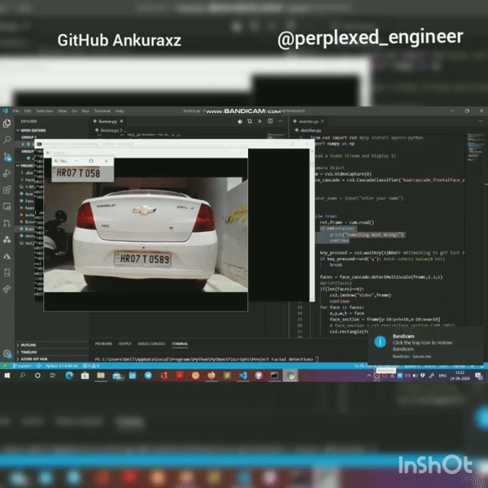

# Automatic-Vehicle-Registration
Detect and read Number plates of Vehicles (Indian). Add them to a Realtime Database and check data with India Traffic Regulation body api
Application
1. Automatic Registration
2. Automatic Fuling, Smart Parking, Pollution Certificate
3. Security
### EXAMPLE ON MY VEHICLE

